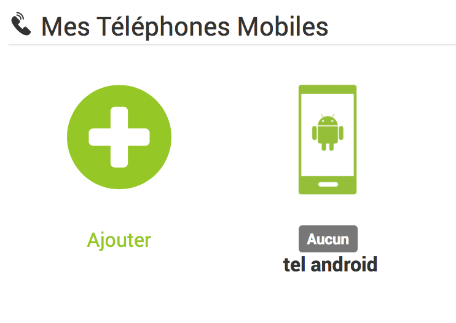
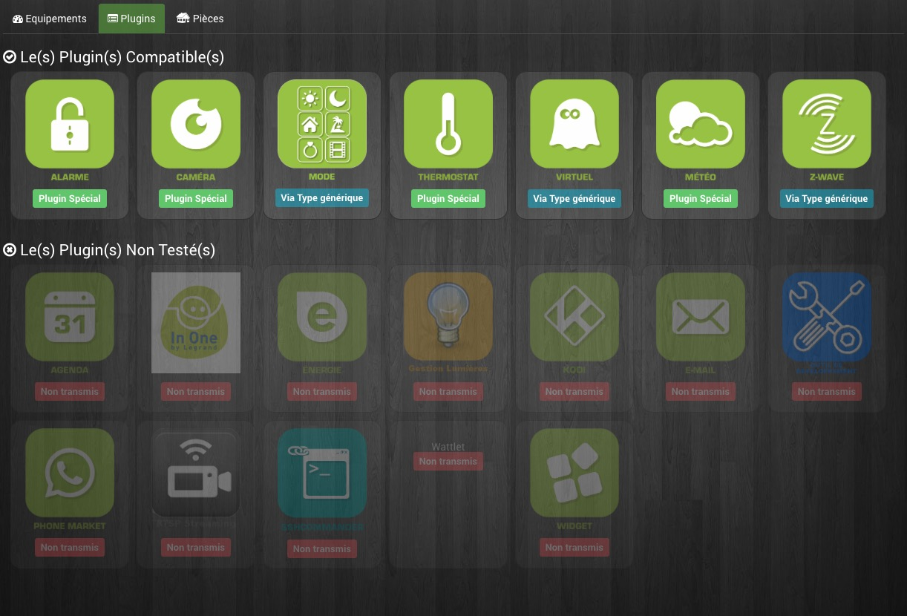
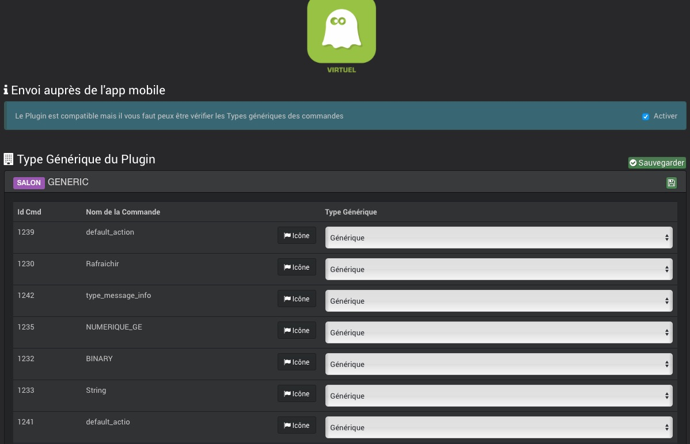
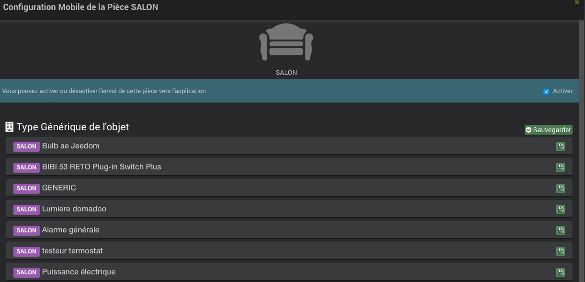
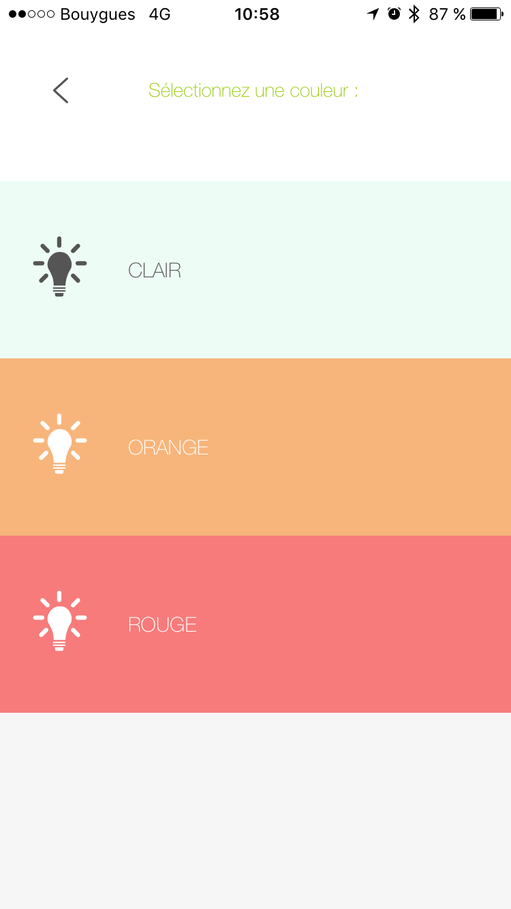
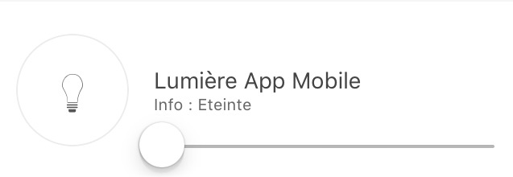

Plugin for using the Jeedom Mobile application.

The Jeedom mobile application requires the installation of this plugin in order to
the box can communicate with the Mobile application.

Mobile plugin configuration 
==============================

After installing the plugin, you just need to activate it :

**Setup**

To configure the plugin, you must add the phones that
will be able to access Jeedom.

To Add a phone : **Plugins** → **Communication** → **App
Mobile** → **Add**

Here are the parameters to enter :

-   **Name of mobile equipment** : Phone name

-   **Activate** : Enabling access for this mobile

-   **Mobile Type** : Phone OS selection (iOS, Android)

-   **User** : User associated with this access

> **Tip**
>
> The choice of the user is important because it determines the
> equipment to which the latter will have access according to his rights.

After saving, you will get a QRCode allowing
the application to configure itself.

Setup of plugins and commands received by the app 
=======================================================

After initializing the Mobile Plugin you have the option of
rework generic types of controls, plugins and parts.

By clicking on a plugin, you can authorize it or not to chat
with the mobile app, and configure each of the generic types
associated with his orders.

By clicking on a part, you can authorize it or not to be
present in the mobile application, and configure each of the types
generics associated with his orders.

Mobile app configuration 
=====================================

You will find the applications on the mobile blinds :

**Android Google Play**

**Apple App Store**

First launch of the app 
--------------------------

On the 1st launch of the Mobile application, a tutorial will be offered
in order to assist you in configuring it.

After downloading and installing your Jeedom mobile app,
launch the application on your smartphone.

You then arrive in a configuration tutorial that we
advise to follow. Some steps have been done previously.

You will then have the choice between a manual configuration or
automatic by QRcode. If you choose the configuration by QRcode,
just flash the QRcode on the Mobile App plugin in
smartphone equipment created previously. In this case, the application will
automatically retrieve the entire configuration of your Jeedom and
connect automatically. When it is connected to your home via Wifi,
the application will automatically use the Jeedom ethernet address
internal to your network. When you are connected in 4G or 3G, there
will use your external address to connect to your Jeedom (by
example via Jeedom DNS service if you use it). If you choose
for manual configuration, in this case you will have to enter the
hand the internal and external IP addresses of your Jeedom. This option
is reserved for an informed public.

The application will synchronize and you will arrive on its home page
(preceded by a mini presentation guide).

Jeedom mobile app is now ready to work.

Favorites 
-----------

On the application you can have Favorites (shortcuts of
commands, plugins, scenarios).

Here is the procedure for creating them :

Click on one of the + on the home screen of the application :

You will arrive on the shortcut type selection page :

For example, we are going to take Action, so it offers us
Rooms / Objects :

You just need to select the action you want in
shortcut :

It is then possible to customize the color of it (for the
three colors are available) :

As well as the two associated texts :

 ![mobile
dashboard 7] (../ images / mobile_dashboard_7.PNG)

Here, you have now a shortcut of your order (in the
version 1.1 On / Off commands are expected to appear on the
same key).

How to properly configure generic types 
============================================

Generic Types in the Mobile plugin 
------------------------------------------

Better than words, here is an example of typical generics for a
light with all its controls (see also the table Light plus
low) :

Application template tables 
---------------------------------------

### The lights #

Picture                           | Type generic               | Dev plugin part            | Description          |
:-----------------------------: | :--------------------------- | :--------------------------- | :------------------: |
 | `Lumière Bouton On` `Lumière Bouton Off` | `LIGHT_ON` `LIGHT_OFF`| présence de deux boutons "ON" et "Off" pas de retour d'état. |
 | `Lumière Bouton On` `Lumière Bouton Off` `Lumière Etat` | `LIGHT_ON` `LIGHT_OFF` `LIGHT_STATE` | Retour d'état présent, le bouton de gauche permet de switcher entre On et Off |
 | `Lumière Bouton Toggle` `Lumière Etat` | `LIGHT_TOGGLE` `LIGHT_STATE` | Retour d'état présent, le bouton de gauche permet de switcher entre On et Off |
 | `Lumière Bouton On` `Lumière Bouton Off` `Lumière Etat` `Lumière Slider` | `LIGHT_ON` `LIGHT_OFF` `LIGHT_STATE` `LIGHT_SLIDER` | Retour d'état présent, le bouton de gauche permet de switcher entre On et Off et le slider permet de contrôler l'intensité |
 | `Lumière Bouton On` `Lumière Bouton Off` `Lumière Etat` `Lumière Slider` `Lumière Couleur (info)` `Lumière Couleur (action)` `Lumière Mode` (optionnel, il sert à avoir des mode de lumière,par exemple arc-en-ciel sur les philips Hue) | `LIGHT_ON` `LIGHT_OFF` `LIGHT_STATE` `LIGHT_SLIDER` `LIGHT_COLOR` `LIGHT_SET_COLOR` `LIGHT_MODE` | Retour d'état présent, le bouton de gauche permet de switcher entre On et Off et le slider permet de contrôler l'intensité. Dans le cercle la couleur de la lampe est présente et lors d'un cloc dans celui-ci vous pouvez changer la couleur et activer un mode |

### The plugs #

Picture                           | Type generic               | Dev plugin part            | Description          |
:-----------------------------: | :--------------------------- | :--------------------------- | :------------------: |
 | `Prise Bouton On` `Prise Bouton Off`| `ENERGY_ON` `ENERGY_OFF`| présence de deux boutons "ON" et "Off" pas de retour d'état. |
 | `Prise Bouton On` `Prise Bouton Off` `Prise Etat` | `ENERGY_ON` `ENERGY_OFF` `ENERGY_STATE` | Retour d'état présent, le bouton de gauche permet de switcher entre On et Off |
 | `Prise Bouton On` `Prise Bouton Off` `Prise Etat` `Prise Slider` | `ENERGY_ON` `ENERGY_OFF` `ENERGY_STATE` `ENERGY_SLIDER` | Retour d'état présent, le bouton de gauche permet de switcher entre On et Off et le slider permet de contrôler l'intensité |

### Shutters #

Picture                           | Type generic               | Dev plugin part            | Description          |
:-----------------------------: | :--------------------------- | :--------------------------- | :------------------: |
   | `Volet Bouton Monter` `Volet Bouton Descendre` `Volet Bouton Stop` `Volet Etat`(optionnel) | `FLAP_UP` `FLAP_DOWN` `FLAP_STOP` `FLAP_STATE`(optionnel) | Presence de trois boutons "Monter", "Descendre", "Stop", retour d'état optionnel. |
   | `Volet Bouton Monter` `Volet Bouton Descendre` `Volet Bouton Stop` `Volet Etat` `Volet Bouton Slider` | `FLAP_UP` `FLAP_DOWN` `FLAP_STOP` `FLAP_STATE` `FLAP_SLIDER` | Presence d'un slider, avec un bouton Monter/Descendre en Toggle (avec icône d'état) |

### Flood #

Picture                           | Type generic               | Dev plugin part            | Description          |
:-----------------------------: | :--------------------------- | :--------------------------- | :------------------: |
   | `Innondation` `Temperature`(optionnel) `Humidité`(optionnel) `Sabotage`(optionnel)|`FLOOD` `TEMPERATURE`(optionnel) `HUMIDITY`(optionnel) `HUMIDITY`(optionnel) | Permet d'avoir son capteur d'inondation complet sur une seule ligne.

### Lock #

Picture                         | Type generic               | Dev plugin part            | Description          |
:---------------------------: | :--------------------------- | :--------------------------- | :------------------: |
   | `Lock Etat` `Lock Bouton Ouvrir` `Lock Bouton Fermer` | `LOCK_STATE` `LOCK_OPEN` `LOCK_CLOSE` | Retour d'état présent, le bouton de gauche permet de switcher entre on et off |

### Mermaid #

Picture                         | Type generic               | Dev plugin part            | Description          |
:---------------------------: | :--------------------------- | :--------------------------- | :------------------: |
   | `Mermaid Etat` `Mermaid Bouton On` `Mermaid Bouton Off` | `SIREN_STATE` `SIREN_ON` `SIREN_OFF` | Retour d'état présent, le bouton de gauche permet de switcher entre on et off |

### Smoke #

Picture                           | Type generic               | Dev plugin part            | Description          |
:-----------------------------: | :--------------------------- | :--------------------------- | :------------------: |
   | `Smoke` `Temperature`(optionnel)|`SMOKE` `TEMPERATURE`(optionnel) | Permet d'avoir son capteur de fumée complet sur une seule ligne.

### Temperature #

Picture                                       | Type generic               | Dev plugin part            | Description          |
:-----------------------------------------: | :--------------------------- | :--------------------------- | :------------------: |
   | `Temperature` `Humidité`(optionnel)|`TEMPERATURE` `HUMIDITY`(optionnel) | Voir Picture.

### Presence #

Picture                                 | Type generic               | Dev plugin part            | Description          |
:-----------------------------------: | :--------------------------- | :--------------------------- | :------------------: |
   | `Presence` `Temperature`(optionnel) `Luminosité`(optionnel) `Humidité`(optionnel) `UV`(optionnel) `Sabotage`(optionnel)|`PRESENCE` `TEMPERATURE`(optionnel) `BRIGHTNESS`(optionnel) `HUMIDITY`(optionnel) `UV`(optionnel) `SABOTAGE`(optionnel) | Voir image.

### Opening #

Picture                                       | Type generic               | Dev plugin part            | Description          |
:-----------------------------------------: | :--------------------------- | :--------------------------- | :------------------: |
   | `Porte / Fenêtre` `Temperature`(optionnel)|`OPENING / OPENING_WINDOW` `TEMPERATURE`(optionnel) | Voir Picture (à savoir que vous pouvez choisir entre fenêtre et porte).

### Pilot wire #

Picture                               | Type generic               | Dev plugin part            | Description          |
:---------------------------------: | :--------------------------- | :--------------------------- | :------------------: |
   | `Chauffage fil pilote Bouton ON` `Chauffage fil pilote bouton OFF` `Chauffage fil pilote Etat` `Chauffage fil pilote bouton`(optionnel) | `HEATING_ON` `HEATING_OFF` `HEATING_STATE` `HEATING_OTHER`|Les boutons ON/OFF et Etat permette de créer le bouton tout à gauche du template et les `chauffage fil pilote Bouton`sont là pour rajouter des boutons (5 max)

THE JOKERS 
----------

### Generic Action #

Picture                             | Type generic               | Dev plugin part            | Description          |
:-------------------------------: | :--------------------------- | :--------------------------- | :------------------: |
   | `Action Générique`           | `GENERIC_ACTION`             | Le bouton prend la forme du type de l'action. Par défaut c'est un toggle, si c'est un message alors vous avez une enveloppe, si slider vous avez un slider etc...

### Generic Info #

Picture                         | Type generic               | Dev plugin part            | Description          |
:---------------------------: | :--------------------------- | :--------------------------- | :------------------: |
   | `Information Générique`           | `GENERIC_INFO`             | Le bouton prend la forme du type de l'info.

Troubleshooting 
===============

Mobile Help 
-----------

**→ I'm on Android version of the app (1.0.1 or 1.0.0) i can't
no access to my rooms or even to the configuration of the app.**

> **Bail**
>
> You had a popup warning you of a concern about the parameters
> accessibility, you just need to go to the
> accessibility settings of your mobile and uncheck them
> applications using this option. (A fix will be made
> soon on the app)

**→ I have a message in one of the lines of my modules telling me that it
missing a Generic Type !**

> **Tip**
>
> By reading this message, it tells you which generic type is missing for
> create a compatible template. Just apply it.
> Refer to [doc chapter Type
> Generic] (https://www.jeedom.com/doc/documentation/plugins/mobile/fr_FR/mobile#_configuration_des_plugins_et_commandes_que_reçoit_l_app).

**→ I have a problem with one of the so-called fully integrated plugins (weather,
thermostat, alarm, camera) !**

> **Tip**
>
> Do not hesitate to access your module and to click on
> save again, this will re-include the types
> credits associated with the module.

**→ Impossible to put an info on the welcome of the app !**

> **Tip**
>
> This is normal, it will be available on version 1.1.

**→ I have the application which takes up a lot of memory in my
Phone !**

> **Tip**
>
> There was a bug on versions 1.0.0 and 1.0.1 on the game
> Camera. The problem will not happen again with 1.0.2, to delete
> hide it without overpricing the app, just go to the configuration
> from your Mobile App and click on "delete cache".

**→ I have a concern of first synchronization on the app or of sql on the mobile plugin !**

> **Tip**
>
> you have to put generic types and authorize the plugin to send generics see the doc a little higher.
