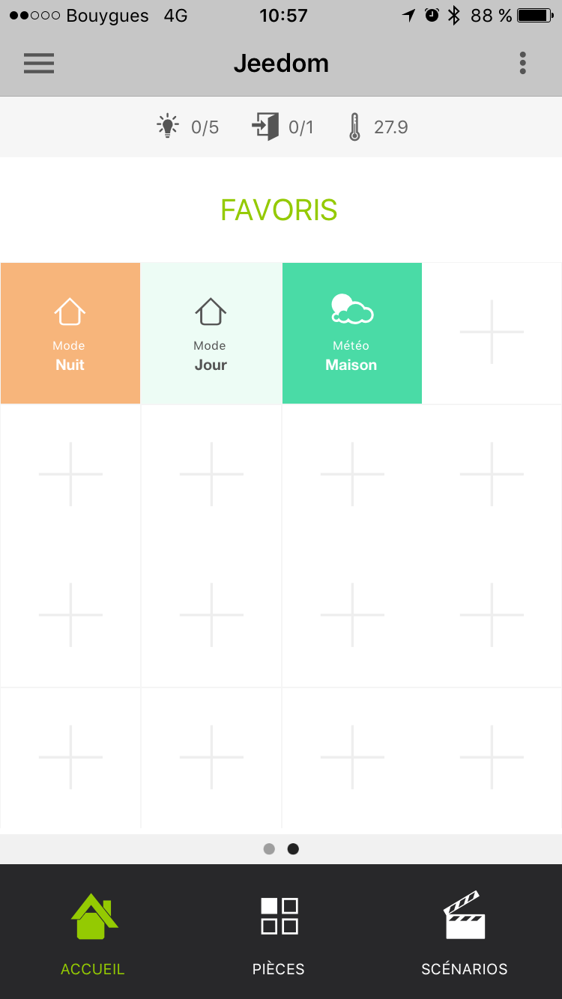
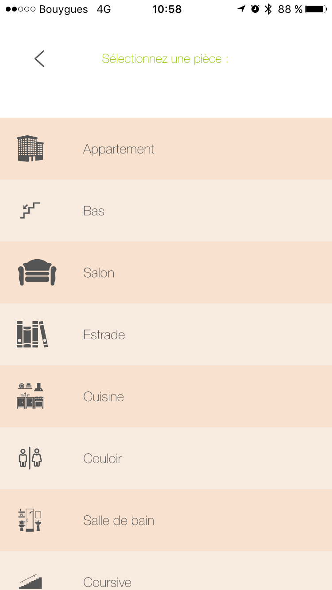
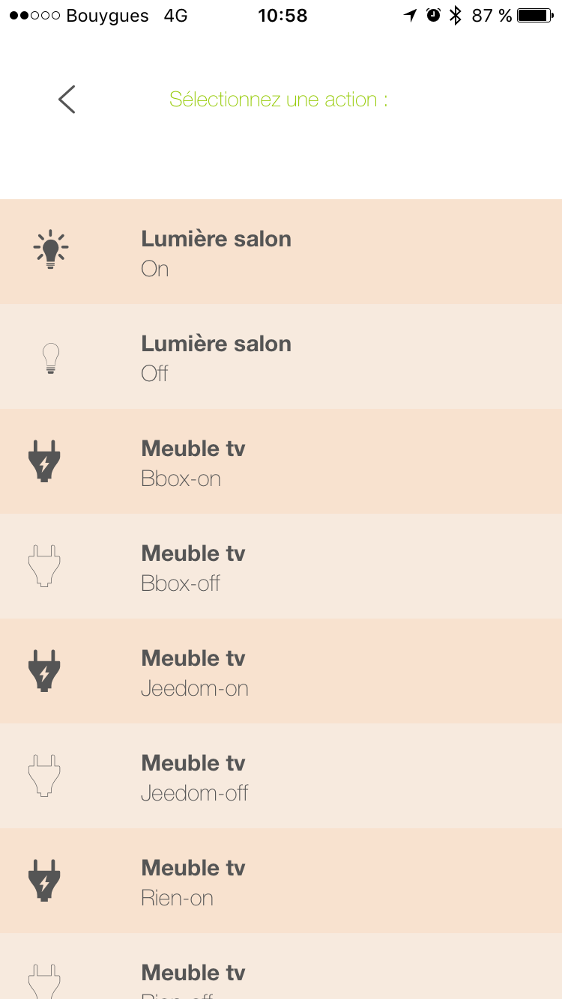
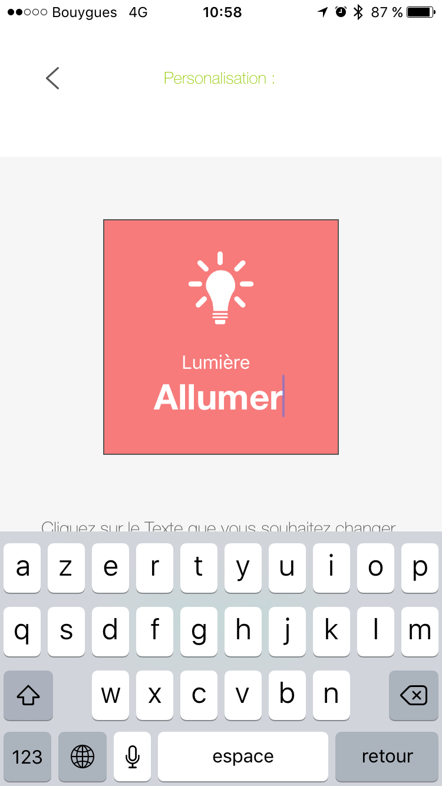
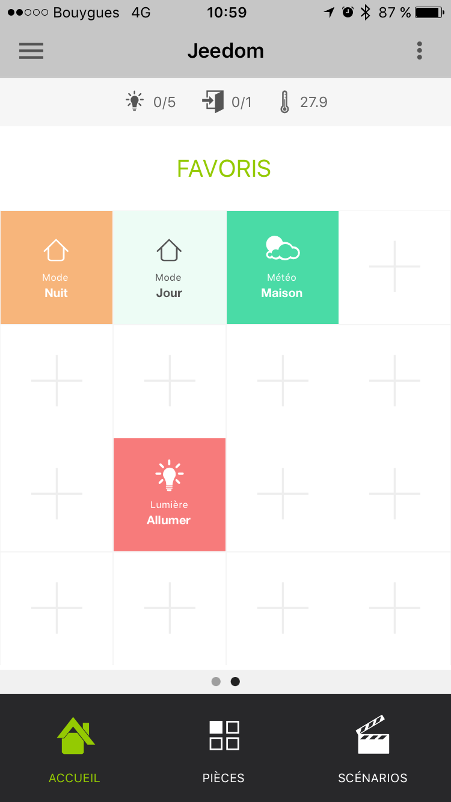
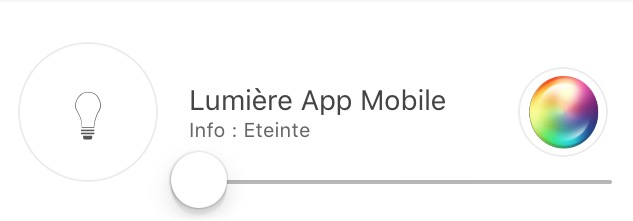

# Mobile Plugin

Plug-in para usar o aplicativo Jeedom Mobile.

O aplicativo móvel Jeedom requer a instalação deste plug-in para que a caixa possa se comunicar com o aplicativo móvel.

# Configuração de plug-in móvel

Depois de instalar o plugin, você só precisa ativá-lo :

**Configuração**

Para configurar o plug-in, você deve adicionar os telefones que poderão acessar o Jeedom.

Para adicionar um telefone : **Plugins** → **Comunicação** → **App
Móvel** → **Adicionar**

Aqui estão os parâmetros para inserir :

-   **Nome do equipamento móvel** : Nome do telefone
-   **Ativar** : Ativando o acesso para este celular
-   **Tipo de celular** : Seleção de SO do telefone (iOS, Android)
-   **Usuário** : Usuário associado a este acesso

> **Dica**
>
> A escolha do usuário é importante, pois determina o equipamento ao qual ele terá acesso de acordo com seus direitos.

Após salvar, você receberá um QRCode permitindo que o aplicativo se configure.

# Configuração de plugins e comandos recebidos pelo aplicativo

Após a inicialização do Mobile Plugin, você tem a possibilidade de modificar os tipos genéricos de pedidos, plugins e peças.

Ao clicar em um plug-in, você pode autorizá-lo ou não a conversar com o aplicativo móvel e configurar cada um dos tipos genéricos associados aos seus comandos.

Ao clicar em uma peça, você pode autorizá-la ou não a estar presente no aplicativo móvel e configurar cada um dos tipos genéricos associados a seus pedidos.

# Configuração de aplicativo para dispositivos móveis

Você encontrará os aplicativos nas persianas móveis :

**Android Google Play**

**Apple App Store**

## Primeiro lançamento do aplicativo

Ao iniciar o aplicativo Mobile pela primeira vez, você receberá um tutorial para ajudá-lo a configurá-lo.

Após baixar e instalar o aplicativo móvel Jeedom, inicie o aplicativo no seu smartphone.

Você chega em um tutorial de configuração que recomendamos que você siga. Algumas etapas foram realizadas anteriormente.

Você poderá escolher entre uma configuração manual ou automática pelo QRcode. Se você optar pela configuração do QRcode, basta exibir o QRcode presente no plug-in Mobile App no equipamento para smartphone criado anteriormente. Nesse caso, o aplicativo recuperará automaticamente toda a configuração do seu Jeedom e se conectará automaticamente. Quando estiver conectado à sua casa via Wifi, o aplicativo usará automaticamente o endereço Ethernet Jeedom interno à sua rede. Quando você está conectado em 4G ou 3G, ele usa seu endereço externo para conectar-se ao seu Jeedom (por exemplo, através do serviço DNS Jeedom, se você o usar). Se você escolher a configuração manual, nesse caso, será necessário inserir manualmente os endereços IP internos e externos do seu Jeedom. Esta opção está reservada a um público informado.

O aplicativo será sincronizado e você chegará à sua página inicial (precedida por um mini guia de apresentação).

O aplicativo móvel Jeedom está pronto para funcionar.

## Favoritos

No aplicativo, você pode ter Favoritos (atalhos de comandos, plugins, cenários).

Aqui está o procedimento para criá-los :

Clique em um dos + na tela inicial do aplicativo :

Você chegará à página de seleção do tipo de atalho :

Por exemplo, vamos executar uma ação, por isso nos oferece moedas / objetos :

Em seguida, basta selecionar a ação que deseja como atalho :

É então possível personalizar a cor deste (no momento, três cores são propostas) :

Bem como os dois textos associados :

Aqui, você tem agora um atalho do seu pedido (na versão 1.1 Espera-se que os comandos On / Off apareçam na mesma tecla).

# Como configurar corretamente tipos genéricos

## Tipos genéricos no plug-in Mobile

Melhor que as palavras, aqui está um exemplo dos créditos genéricos para uma luz com todos os seus controles (veja também a tabela Luz abaixo) :

## Tabelas de modelo de aplicativo

### As luzes

Imagem                           | Tipo genérico               | Parte do plugin Dev            | Descrição          |
:-----------------------------: | :--------------------------- | :--------------------------- | :------------------: |
 | `Lumière Bouton On` `Botão apagado` | `LIGHT_ON` `LIGHT_OFF`| presença de dois botões "ON" e "Off" sem feedback de status. |
 | `Lumière Bouton On` `Botão apagado` `Luz do estado` | `LIGHT_ON` `LIGHT_OFF` `LIGHT_STATE` | Feedback de status presente, o botão esquerdo alterna entre ligado e desligado |
 | `Lumière Bouton Toggle` `Luz do estado` | `LIGHT_TOGGLE` `LIGHT_STATE` | Feedback de status presente, o botão esquerdo alterna entre ligado e desligado |
 | `Lumière Bouton On` `Botão apagado` `Luz do estado` `Light Slider` | `LIGHT_ON` `LIGHT_OFF` `LIGHT_STATE` `LIGHT_SLIDER` | Feedback de status presente, o botão esquerdo permite alternar entre On e Off e o controle deslizante permite controlar a intensidade |
 | `Lumière Bouton On` `Botão apagado` `Luz do estado` `Light Slider` `Cor clara (informação)` `Cor clara (ação)` `Light Mode` (opcional, é usado para ter modos de luz, por exemplo, arco-íris na Hue philips) | `LIGHT_ON` `LIGHT_OFF` `LIGHT_STATE` `LIGHT_SLIDER` `LIGHT_COLOR` `LIGHT_SET_COLOR` `LIGHT_MODE` | Feedback de status presente, o botão esquerdo permite alternar entre On e Off e o controle deslizante permite controlar a intensidade. No círculo, a cor da lâmpada está presente e, quando você clica nela, pode alterar a cor e ativar um modo |

### As tomadas

Imagem                           | Tipo genérico               | Parte do plugin Dev            | Descrição          |
:-----------------------------: | :--------------------------- | :--------------------------- | :------------------: |
 | `Prise Bouton On` `Botão fora do soquete`| `ENERGY_ON` `ENERGY_OFF`| presença de dois botões "ON" e "Off" sem feedback de status. |
 | `Prise Bouton On` `Botão fora do soquete` Tomada de Estado | `ENERGY_ON` `ENERGY_OFF` `ENERGY_STATE` | Feedback de status presente, o botão esquerdo alterna entre ligado e desligado |
 | `Prise Bouton On` `Botão fora do soquete` Tomada de Estado `Soquete deslizante` | `ENERGY_ON` `ENERGY_OFF` `ENERGY_STATE` `ENERGY_SLIDER` | Feedback de status presente, o botão esquerdo permite alternar entre On e Off e o controle deslizante permite controlar a intensidade |

### As persianas

Imagem                           | Tipo genérico               | Parte do plugin Dev            | Descrição          |
:-----------------------------: | :--------------------------- | :--------------------------- | :------------------: |
   | `Volet Bouton Monter` `Painel de botões para baixo` `Painel do botão Stop ' Painel de estado (opcional) | `FLAP_UP` `FLAP_DOWN` `FLAP_STOP` `FLAP_STATE` (opcional) | Presença de três botões "Para cima", "Para baixo", "Parar", feedback opcional do status. |
   | `Volet Bouton Monter` `Painel de botões para baixo` `Painel do botão Stop ' Painel de estado `Painel do botão deslizante` | `FLAP_UP` `FLAP_DOWN` `FLAP_STOP` `FLAP_STATE` `FLAP_SLIDER` | Presença de um controle deslizante, com um botão Acima / Abaixo em Alternar (com ícone de status) |

### Inondation

Imagem                           | Tipo genérico               | Parte do plugin Dev            | Descrição          |
:-----------------------------: | :--------------------------- | :--------------------------- | :------------------: |
   | `Innondation` TEMPERATURA (opcional) Humidade (opcional) `SABOTAGE` (opcional)|`FLOOD` TEMPERATURA (opcional) «UMIDADE» (opcional) «UMIDADE» (opcional) | Permite que você tenha seu sensor de inundação completo em uma única linha.

### Serrure

Imagem                         | Tipo genérico               | Parte do plugin Dev            | Descrição          |
:---------------------------: | :--------------------------- | :--------------------------- | :------------------: |
   | `Bloquear Etat` `Abrir botão de bloqueio` `Fechar botão de bloqueio` | `LOCK_STATE` `LOCK_OPEN` `LOCK_CLOSE` | Feedback de status presente, o botão esquerdo alterna entre ligado e desligado |

### Sereia

Imagem                         | Tipo genérico               | Parte do plugin Dev            | Descrição          |
:---------------------------: | :--------------------------- | :--------------------------- | :------------------: |
   | `Sereia Etat` `Botão da sirene ligado` `Botão da sirene desativado` | `SIREN_STATE` `SIREN_ON` `SIREN_OFF` | Feedback de status presente, o botão esquerdo alterna entre ligado e desligado |

### Fumaça

Imagem                           | Tipo genérico               | Parte do plugin Dev            | Descrição          |
:-----------------------------: | :--------------------------- | :--------------------------- | :------------------: |
   | `Fumaça` TEMPERATURA (opcional)|`SMOKE` TEMPERATURA (opcional) | Permite que você tenha seu sensor de fumaça completo em uma única linha.

### Temperatura

Imagem                                       | Tipo genérico               | Parte do plugin Dev            | Descrição          |
:-----------------------------------------: | :--------------------------- | :--------------------------- | :------------------: |
   | `Temperatura` Humidade (opcional)|`TEMPERATURE` «UMIDADE» (opcional) | Veja a imagem.

### Presença

Imagem                                 | Tipo genérico               | Parte do plugin Dev            | Descrição          |
:-----------------------------------: | :--------------------------- | :--------------------------- | :------------------: |
   | `Presença` TEMPERATURA (opcional) `Brilho` (opcional) Humidade (opcional) `UV '(opcional) `SABOTAGE` (opcional)|`PRESENCE` TEMPERATURA (opcional) `BRILHO` (opcional) «UMIDADE» (opcional) `UV '(opcional) `SABOTAGE` (opcional) | Veja a imagem.

### Ouvrant

Imagem                                       | Tipo genérico               | Parte do plugin Dev            | Descrição          |
:-----------------------------------------: | :--------------------------- | :--------------------------- | :------------------: |
   | `Porte / Fenêtre` TEMPERATURA (opcional)|`OPENING / OPENING_WINDOW` TEMPERATURA (opcional) | Veja Imagem (ou seja, você pode escolher entre janela e porta).

### Fio piloto

Imagem                               | Tipo genérico               | Parte do plugin Dev            | Descrição          |
:---------------------------------: | :--------------------------- | :--------------------------- | :------------------: |
   | `Chauffage fil pilote Bouton ON` `Botão OFF do fio piloto de aquecimento` `Estado do fio piloto de aquecimento` `Aquecimento do fio piloto de botão` (opcional) | `HEATING_ON` `HEATING_OFF` `HEATING_STATE` `HEATING_OTHER`|Os botões ON / OFF e Status permitem criar o botão na extremidade esquerda do modelo e o `botão de aquecimento do fio piloto` está lá para adicionar botões (no máximo 5)

## OS JOKERS

### Ação genérica

Imagem                             | Tipo genérico               | Parte do plugin Dev            | Descrição          |
:-------------------------------: | :--------------------------- | :--------------------------- | :------------------: |
   | `Action Générique`           | `GENERIC_ACTION`             | Le bouton prend la forme du type de l'action. Par défaut c'est un toggle, si c'est un message alors vous avez une enveloppe, si slider vous avez un slider etc...

### Informações genéricas

Imagem                         | Tipo genérico               | Parte do plugin Dev            | Descrição          |
:---------------------------: | :--------------------------- | :--------------------------- | :------------------: |
   | `Information Générique`           | `GENERIC_INFO`             | Le bouton prend la forme du type de l'info.

# Troubleshooting

**Estou na versão Android do aplicativo (1.0.1 ou 1.0.0) Não consigo acessar minhas partes ou mesmo a configuração do aplicativo.**

Você tinha um pop-up alertando sobre uma preocupação com as configurações de acessibilidade; basta acessar as configurações de acessibilidade do seu celular e desmarcar os aplicativos usando esta opção. (Uma correção será trazida em breve no aplicativo)

**Eu tenho uma mensagem em uma das linhas dos meus módulos dizendo que
sem um tipo genérico !**

Ao ler esta mensagem, ele informa qual tipo genérico está ausente para criar um modelo compatível. Apenas aplique.Consulte o [doc capítulo Tipo genérico](https://www.jeedom.com/doc/documentation/plugins/mobile/pt_PT/mobile#_configuration_des_plugins_et_commandes_que_reçoit_l_app).

**Estou com um problema com um dos plug-ins chamado totalmente integrado,
termostato, alarme, câmera) !**

Não hesite em acessar seu módulo e clique em Salvar novamente. Isso incluirá novamente os tipos genéricos associados ao módulo.

**Não foi possível colocar uma informação sobre as boas-vindas do aplicativo !**

Isso é normal, estará disponível na versão 1.1.

**Eu tenho o aplicativo que ocupa muita memória no meu
Telefone !**

Houve um erro nas versões 1.0.0 e 1.0.1 na parte da câmera. O problema não acontecerá novamente com 1.0.2, para excluir o cache sem aumentar o preço do aplicativo, basta acessar a configuração do seu aplicativo móvel e clicar em "excluir o cache".

**Tenho uma preocupação de primeira sincronização no aplicativo ou de sql no plug-in móvel !**

Você precisa colocar tipos genéricos e autorizar o plug-in a enviar genéricos, veja o documento um pouco mais alto.
